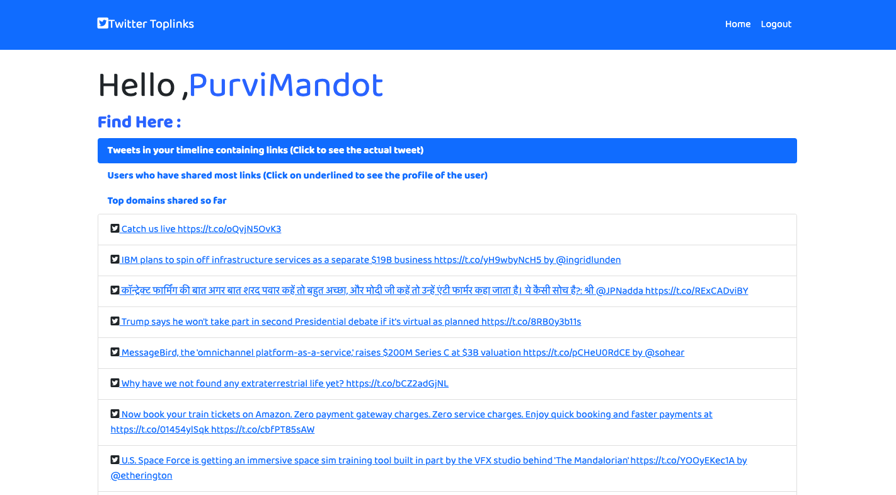
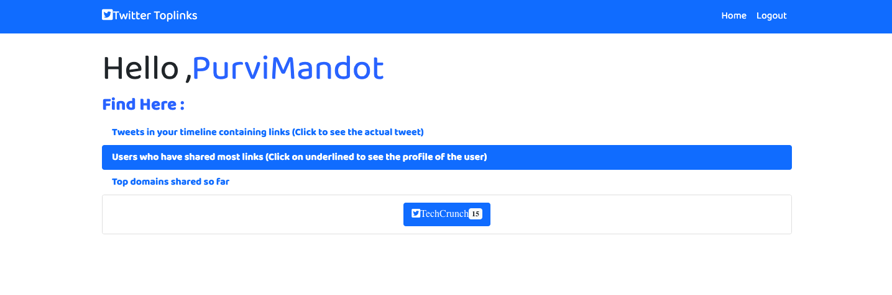

# Twitter Top Links Web App

The project aims at building a web application with `Django Framework` that confirms with the following specs -

- Authenticating the user with Twitter account.
- After the user is logged in, fetching and displaying tweets containing urls from user's timeline (both friends + user's tweets) from past 7 days.
- Display top users that have shared most links.
- Highlighting trending domains from user's timeline.


## Deployment

- Web App has been successfully deployed on 'Heroku(PaaS)'. It can be accessed [here](https://twitter-toplinkz.herokuapp.com/).

## Pre-Requisites

- Python v3.8 should be installed on your system
- Django Framework should be installed on your system
- Basic understanding of HTML, CSS, JS
- PIP Packages should be installed on your system
- Understanding of Tweepy API
- Developer account on Twitter for Secret Keys
- Read the installing dependencies and starting the project section below carefully before usage.

## Technology Stack

**Frontend**

- HTML
- CSS
- JavaScript
- Bootstrap

**Backend**

- Django
- Python 3.8

  **Database**

- SqLite3

**APIs**

- Twitter API - for secret keys
- Tweepy API - An easy-to-use Python library for accessing the Twitter API

## Installing Dependencies

To run the app locally follow the below steps :

- Clone the repository.

```
git clone https://github.com/purvimandot/Twitter_toplinks.git
```

- Run the following command :

```
pip install -r requirements.txt
```

- To Make `migrations` to the database:

```
python3 manage.py makemigrations
python3 manage.py migrate
```


- To Generate a `secret key` for django app, Go to this website [here](https://djecrety.ir/)

- Click on Generate Button
- And Copy this Generated Secret Key
- Paste this Key in `SECRET_KEY` in `settings.py` file in twitter folder .
- Also get `CONSUMER_KEY` AND `CONSUMER_SECRET` using Twitter Developer Account from [here](https://developer.twitter.com/en) and store in `settings.py` file and `views.py` in toplinks folder.
- Finally the three variables will look like -

```
SOCIAL_AUTH_TWITTER_KEY = "Your_Consumer_Key"
SOCIAL_AUTH_TWITTER_SECRET = "Your_Consumer_Secret"
SECRET_KEY = "Your_Secret_Key"
```

## Starting the Project

- Start the project using -

```
python3 manage.py runserver
```

- Browse to http://127.0.0.1:8000/ to see your web app.

## Implementation

- On Landing page we have a `Login with Twitter' button.
- After clicking on it will take user to `Twitter Login Page`.
- After clicking on `Login with Twitter` button, `Tweepy API` will take user to authorize with Twitter page and will validate user's credentials. If correct it will redirect the user to `Home` page containing information about user's timeline.
- User's data in stored in `database` which is then used to find out top users and top domains.
- Tweet information database is stored using `Tweepy API`. Tweets containing urls and of past 7 days are fetched using `home_timeline` method and stored in `Tweet Database`. Tweet's author is stored in `TwitterUser Database`.
- On the home page in 'Tweets in your Timeline' you will also get the feature to go to the `Actual tweet link on twitter` by clicking on the tweet link in the card shown.
- You can also go to `User's profile on twitter` by clicking on user name in the card shown in 'Users who have shared most links'.
- Clicking on `logout` button on dashboard page will take user back to `home` page.
- While being logged in, if user goes to login page it shows Go to `Home Button` and `Logout Button`.
- Data Structures used - `Dictionary` for frequnecy and top user and top domain calculation, `List` for storing the tweets and users.


## Workflow

**Login Page**

- Browse to the url [https://twitter-toplinkz.herokuapp.com/](https://twitter-toplinkz.herokuapp.com/) to see the landing page.

- Clicking on 'Login with Twitter' Button will take you to Twitter's Authorization Page.
  
  > Login Page

**Twitter's Authorization Pages**


  

> Twitter Login

**Home Page**

- Home Page containg three dynamic cards - Tweets containg links,Users who have shared most links and Top domains shared so far


- Expanded `Tweets` dropdown card containing tweeted text which is a link to the actual tweet. 



> Expanded Tweets

- Expanded `Top User` dropdown card, containing screen name of user which is a link to the actual user profile on twitter.



> Expanded Top User

- Expanded `Top Domains` dropdown card, showing all the domains with their frequency.


> Expanded Top Domain

## Working Demo

- Full Working Demo of the Project


## Contact Me

You can contact me at <17ucc044@lnmiit.ac.in>
